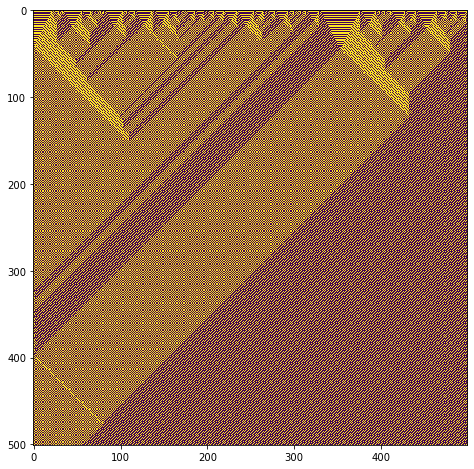
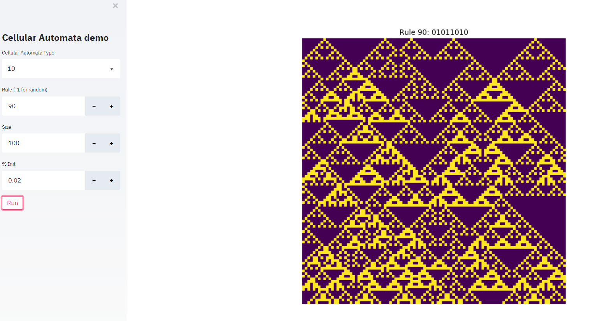

# Experiments with Cellular Automata


> This repo contains experiment on Cellular Automat integrated in a python library ``abio``<br>
> **All computations are done under the hood with PyTorch** to be accelerated but also ease the transition to Neural Cellular Automata 


## Features
- 1D Cellular Automata (computation with 1D-convolutions & visualization)
- 2D Cellular Automata (Game Of Life, and framework to extend) (computation with 2D-convolutions & visualization)
- Streamlit app to facilitate the visualization and use of the library

## Installation of the ``abio`` library
There is no pypi package yet, but you can use the library locally by cloning the repo, installing the requirements and adding the path to the environment

## Library quickstart
### Running a 1D Cellular Automata
```python
from abio.cellular_automata import CellularAutomata1D
ca = CellularAutomata1D()
ca.run_random(rule = 30,size = 100,p_init = 0.02,n_steps = 100)
```

### Running a 2D Cellular Automata
```python
from abio.cellular_automata import GameOfLife

# Instantiate the Cellular Automata wrapper
ca = GameOfLife()

# Compute the Cellular Automata
states = ca.run(500,p_init = 0.5,init_size = 100)

# Apply color on persistent cells + resize to better visualize in the video
states.transform(only_alive = True,resize = (400,400),method = "nearest")

# Save the video locally
states.save_video(fps = fps)
```

## To run the Streamlit app locally

- Clone the repo locally
- Install the requirements file
- Run ``streamlit run index.py``

## Resources
Take a look at my personal website for more resources https://emergence.pub/docs/#understanding-cellular-automata

## License
MIT